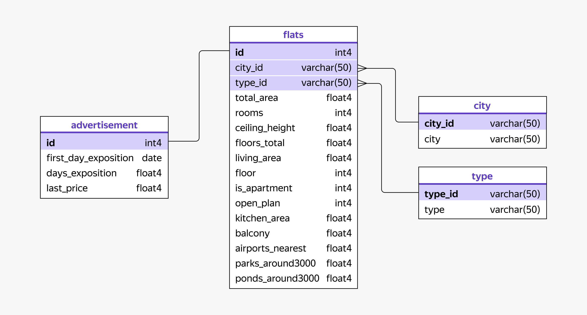

# Анализ рынка недвижимости Санкт-Петербурга и Ленинградской области

**Проект:** Комплексный анализ объявлений о продаже квартир  
**Инструменты:** SQL, DBeaver, DataLens (дашборд)  
**Период данных:** 2015–2018 гг.

## 📊 Описание проекта

Этот проект выполнен для агентства недвижимости. Цель — помочь заказчику:
- понять, какие квартиры продаются быстро, а какие долго остаются на рынке;
- выявить сезонные тенденции активности продавцов и покупателей;
- создать удобный дашборд для мониторинга ключевых метрик.

**📁 Данные:** архив объявлений сервиса «Яндекс Недвижимость» (схема `real_estate`).

## 🗄 ER-диаграмма базы данных

*Связи между таблицами: `advertisement` ↔ `flats` (по id), `flats` ↔ `city` (по city_id), `flats` ↔ `type` (по type_id)*

## Дашборд

🔗 **Ссылка на дашборд (DataLens):** [https://datalens.yandex/scide7l68kvgc](https://datalens.yandex/scide7l68kvgc)

Дашборд создан с нуля и состоит из двух вкладок:
1. **Аналитика рынка недвижимости** — ключевые метрики и фильтры.
2. **Детализация рынка** — углублённый анализ по городам, планировкам, сезонности.

## Структура проекта

1. **Знакомство с данными** — подключение к БД через DBeaver, изучение таблиц и связей.
2. **Задача 1. Время активности объявлений** — анализ длительности публикации.
3. **Задача 2. Сезонность объявлений** — помесячная динамика публикаций и снятий.
4. **Дашборд** — две вкладки с фильтрами, графиками и метриками (создан с нуля по ТЗ).
5. **SQL-запросы** — сохранены в `.sql` файлах для воспроизводимости.

## Задача 1. Время активности объявлений

### Категории активности
Все объявления (только города, 2015–2018) разделены на 4 категории:
- `1-30 days` — до месяца
- `31-90 days` — 1–3 месяца
- `91-180 days` — 3–6 месяцев
- `181+ days` — более полугода
- `non category` — не снятые

### Результаты

#### 1. Самые распространённые категории

**Санкт-Петербург:**
- `181+ days` — 25% всех объявлений
- `31-90 days` — 22%
- `91-180 days` — 16%

**Ленинградская область:**
- `181+ days` — 6%
- `31-90 days` — 6%

👉 И в городе, и в области лидируют «долгие» объявления (более полугода). Это сигнал о низкой ликвидности части объектов.

#### 2. Что влияет на время активности

| Характеристика | Санкт-Петербург | Ленинградская область |
|---|---|---|
| Цена за м² | Выше → дольше продаётся | Ниже → дольше продаётся |
| Жилая площадь | Больше → дольше продаётся | Больше → дольше продаётся |
| Высота потолков | ≈3 м во всех категориях | ≈3 м во всех категориях |
| Комнат (медиана) | 2 | 2 |
| Балконов (медиана) | 1 | 1 |
| Этажность дома | 9–12 | 5 |

📌 **Вывод:** в Санкт-Петербурге дорогие и просторные квартиры продаются дольше. В области аналогично, но цена за м² ведёт себя иначе.

#### 3. Различия между регионами

- На **Санкт-Петербург** приходится **73% всех объявлений**.
- Цена за м² в городе выше в среднем на **30 000 руб**.
- В городе дома выше (медиана 9–12 этажей), в области — 5 этажей.

## Задача 2. Сезонность объявлений

### 1. Пики публикаций и снятий

**Топ-5 месяцев по публикациям:**
1. Ноябрь — 1569 (11%)
2. Октябрь — 1437 (10%)
3. Февраль — 1369 (10%)
4. Сентябрь — 1341 (10%)
5. Июнь — 1224 (9%)

**Топ-5 месяцев по снятиям:**
1. Октябрь — 1360 (10%)
2. Ноябрь — 1301 (9%)
3. Сентябрь — 1238 (9%)
4. Январь — 1225 (9%)
5. Декабрь — 1175 (8%)

📌 **Вывод:** осень — самый активный сезон и для продавцов, и для покупателей.

### 2. Совпадение периодов

✅ Да, периоды публикации и снятия в основном совпадают (осень–зима).  
Исключение: июнь (пик публикаций, но не снятий).

### 3. Влияние сезона на цену и площадь

- **Средняя цена за м²** у опубликованных объявлений минимальна весной, растёт к сентябрю.
- У снятых объявлений цена растёт с мая по октябрь.
- Колебания **площади** по месяцам незначительны.

## Дашборд

### Вкладка «Аналитика рынка недвижимости»

**Что реализовано:**
- Фильтр по типам населённых пунктов
- Показатель «Средняя площадь»
- Метрика «Среднее количество дней продажи на квартиру» (диаграмма с областями)
- Чарт «Топ‑5 по скорости продажи» (населённые пункты с минимальным `days_exposition`)
- Фильтр гранулярности: дни / недели / месяцы / годы (параметр `period` + `DATETRUNC`)

### Вкладка «Детализация рынка»

**Что реализовано:**
- Названия городов вместо `city_id`
- Сортировка по средней стоимости м² (дорогие → дешёвые)
- Градиентная раскраска: 🔴 дорогие, 🟡 средние, 🟢 дешёвые
- Круговая диаграмма заменена на **столбчатые** (планировка / тип жилья)
- Добавлены столбчатые диаграммы: влияние парка и водоёма на цену м²
- Раскраска дней недели: 🟢 максимум, 🔴 минимум, 🟡 остальные
- График «Год × Месяц» для количества объявлений (линии по годам)

## Общие выводы и рекомендации для бизнеса

1. **Самый популярный сегмент**  
   — двухкомнатные квартиры в Санкт-Петербурге, площадью ~58–60 м², на среднем этаже.

2. **Медленно продаётся**  
   — крупная и дорогая недвижимость (особенно в городе).

3. **Лучшее время для маркетинга**  
   — **осень и зима**. Рекомендуется усиливать рекламные кампании с сентября по декабрь.

4. **Область vs город**  
   — рынок области более «низкий» по этажности и цене, но логика зависимости «дороже/больше → дольше» сохраняется.

## 📂 Файлы проекта

- `Рынок_недвижимости.sql` — все основные SQL-запросы
- `ER.png` — ER-диаграмма базы данных
- `README.md` — этот файл

## Контакты

**Автор:** Жигарева Виктория  
**Дата:** 16.12.2025  
**Статус:** учебный проект завершён